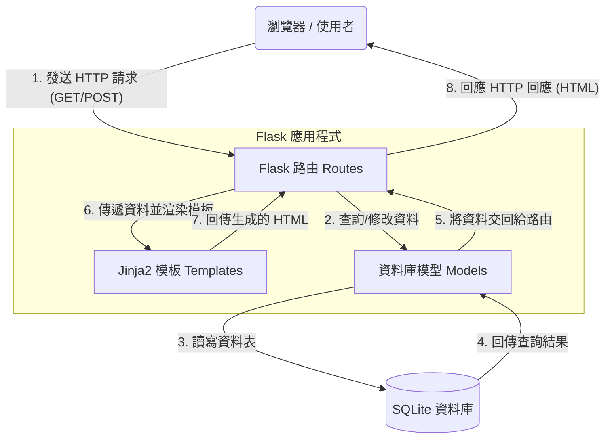

# 系統架構設計文件：食譜收藏系統

根據 [PRD 文件](PRD.md) 的需求，本文件定義了「食譜收藏系統」的技術架構與資料夾結構。

## 1. 技術架構說明

### 選用技術與原因
- **後端框架**：**Python + Flask**
  - **原因**：Flask 是一個輕量級的 Web 框架，學習曲線平緩，適合快速開發中小型專案。它能輕鬆處理 HTTP 請求並提供路由功能。
- **模板引擎**：**Jinja2**
  - **原因**：與 Flask 完美整合，能夠在伺服器端將後端資料直接渲染成 HTML 頁面，無須複雜的前端框架（React/Vue 等）即可完成動態網頁。
- **資料庫**：**SQLite**
  - **原因**：無伺服器的輕量級資料庫，將所有資料儲存於單一檔案中，部署與測試極為便利，非常適合初期與中小型應用。

### Flask MVC 模式說明
本專案採用類似 MVC（Model-View-Controller）的設計模式來組織程式碼：
- **Model（模型）**：負責與 SQLite 資料庫互動，處理資料的儲存、查詢、更新與刪除（CRUD）。
- **View（視圖）**：由 Jinja2 模板（HTML 檔案）擔任，負責將資料呈現給使用者看，並處理 UI 介面。
- **Controller（控制器）**：由 Flask 的路由（Routes）擔任，負責接收使用者的請求、呼叫對應的 Model 處理資料，最後把結果交給 View 來渲染。

---

## 2. 專案資料夾結構

本專案建議採用以下資料夾結構，以保持程式碼的模組化與可維護性：

```text
web_app_development2/
├── app/                      # 應用程式主目錄
│   ├── models/               # 資料庫模型與操作邏輯 (Model)
│   │   ├── __init__.py
│   │   ├── user.py           # 使用者資料模型
│   │   └── recipe.py         # 食譜資料模型
│   ├── routes/               # Flask 路由控制器 (Controller)
│   │   ├── __init__.py
│   │   ├── auth_routes.py    # 註冊、登入等驗證路由
│   │   └── recipe_routes.py  # 食譜相關操作路由
│   ├── templates/            # Jinja2 HTML 模板 (View)
│   │   ├── base.html         # 共用版型（包含 Header, Footer）
│   │   ├── index.html        # 首頁
│   │   ├── login.html        # 登入/註冊頁面
│   │   ├── recipe_list.html  # 食譜列表頁
│   │   └── recipe_detail.html# 食譜詳細頁面
│   └── static/               # CSS / JS / 圖片等靜態資源
│       ├── css/
│       │   └── style.css
│       ├── js/
│       │   └── main.js
│       └── images/
├── instance/                 # 放置不進入版控的環境變數或資料庫檔案
│   └── database.db           # SQLite 資料庫檔案
├── docs/                     # 專案文件 (PRD, 架構文件等)
│   ├── PRD.md
│   └── ARCHITECTURE.md
├── app.py                    # 專案程式入口點 (初始化 Flask APP)
└── requirements.txt          # Python 套件依賴清單
```

---

## 3. 元件關係圖

以下展示了使用者在瀏覽器上的操作如何流經我們設計的架構：



---

## 4. 關鍵設計決策

1. **後端渲染 (Server-Side Rendering) 取代 API 串接**
   - **說明**：考量到專案性質與時程，我們不採用前後端分離（如 React + API）架構，而是讓 Flask 直接回傳渲染好的 HTML 頁面。
   - **優點**：架構單純，開發速度快，且不需處理跨網域 (CORS) 與繁瑣的非同步請求問題。

2. **區分 Routes 與 Models (模組化設計)**
   - **說明**：將路由邏輯與資料庫操作邏輯拆分到不同資料夾，避免 `app.py` 變得過度龐大。
   - **優點**：容易維護與擴充。未來若新增功能（如留言系統），只要各自新增對應的 route 與 model 即可，職責清晰。

3. **使用共用模板 (Base Template)**
   - **說明**：在 `templates/base.html` 中定義網站共用的導覽列 (Navbar) 與頁尾 (Footer)，其他頁面透過 `` 繼承。
   - **優點**：確保網站風格一致，且未來若要修改選單，只需修改一個檔案。

4. **Session-based 身分驗證**
   - **說明**：透過 Flask 內建的 `session` 機制來實作一般人與管理員的登入狀態記錄。
   - **優點**：實作簡單且安全，搭配加密的 session cookie 即可滿足 MVP 的身分驗證需求。
