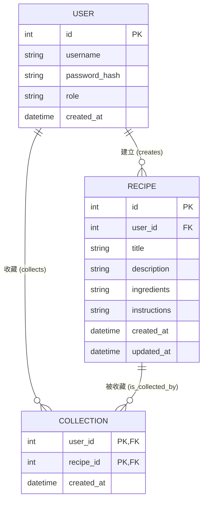

# 資料庫設計文件：食譜收藏系統

根據 PRD 與流程圖，本文件定義了系統所需的資料庫結構、實體關聯 (ER 圖) 以及詳細的欄位說明。

## 1. ER 圖（實體關係圖）

---

## 2. 資料表詳細說明

### 2.1 USER（使用者資料表）
儲存系統使用者的帳號資訊，包含一般使用者與管理員。

| 欄位名稱 | 型別 | 必填 | 說明 |
| :--- | :--- | :--- | :--- |
| `id` | INTEGER | 是 | Primary Key，自動遞增 |
| `username` | TEXT | 是 | 使用者名稱，不可重複 (UNIQUE) |
| `password_hash` | TEXT | 是 | 經過雜湊處理的密碼 |
| `role` | TEXT | 是 | 角色權限：預設為 `user`，管理員為 `admin` |
| `created_at` | TEXT | 是 | 帳號建立時間 (ISO 格式或 DATETIME 寫入字串) |

### 2.2 RECIPE（食譜資料表）
儲存所有使用者建立的公開食譜資訊。

| 欄位名稱 | 型別 | 必填 | 說明 |
| :--- | :--- | :--- | :--- |
| `id` | INTEGER | 是 | Primary Key，自動遞增 |
| `user_id` | INTEGER | 是 | Foreign Key，關聯至 `user.id` (作者) |
| `title` | TEXT | 是 | 食譜名稱 |
| `description` | TEXT | 否 | 食譜簡介或心得 |
| `ingredients` | TEXT | 是 | 所需食材清單 (可儲存換行文字或 JSON) |
| `instructions` | TEXT | 是 | 作法與步驟介紹 |
| `created_at` | TEXT | 是 | 建立時間 |
| `updated_at` | TEXT | 否 | 最後更新時間 |

### 2.3 COLLECTION（收藏紀錄表）
記錄哪個使用者收藏了哪份食譜（多對多關聯的中介表）。

| 欄位名稱 | 型別 | 必填 | 說明 |
| :--- | :--- | :--- | :--- |
| `user_id` | INTEGER | 是 | Foreign Key，關聯至 `user.id` |
| `recipe_id` | INTEGER | 是 | Foreign Key，關聯至 `recipe.id` |
| `created_at` | TEXT | 是 | 收藏時間 |

> **註**：`user_id` 與 `recipe_id` 的組合將作為複合主鍵 (Composite Primary Key)，確保同一位使用者不會重複收藏同一份食譜。

---

## 3. SQL 建表語法與 Python Model

- **建表語法**：位於 `database/schema.sql`，使用 SQLite 語法。
- **Python Model**：位於 `app/models/`，採用 `sqlite3` 實作資料的 CRUD (Create, Read, Update, Delete) 操作，包含：
  - `user.py`: 處理帳號登入、註冊。
  - `recipe.py`: 處理食譜的新增、修改、刪除、查詢。
  - `collection.py`: 處理收藏/取消收藏功能。
