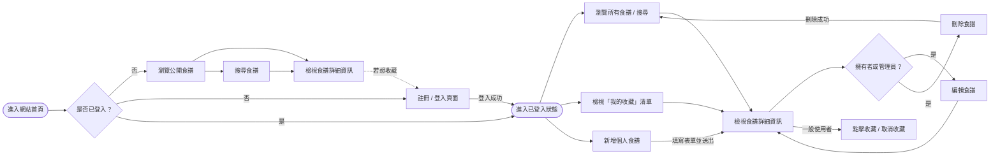
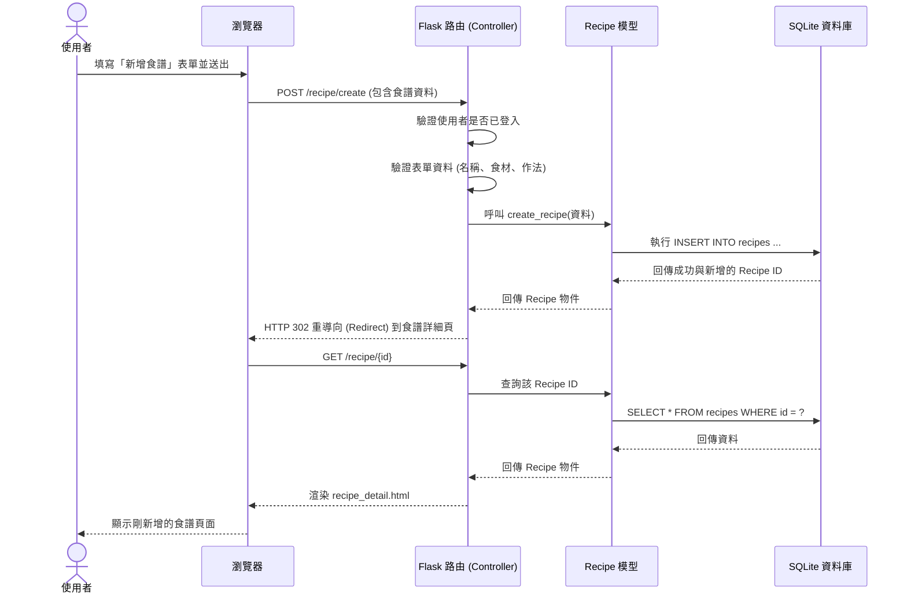

# 流程圖設計文件：食譜收藏系統

根據 PRD 與系統架構文件，本文件視覺化了使用者的操作路徑與系統內部的資料流動，並列出功能與路由的對照表。

## 1. 使用者流程圖（User Flow）

此流程圖展示了使用者在網站中的主要操作路徑，包含瀏覽、搜尋、登入、新增食譜與收藏功能。

---

## 2. 系統序列圖（Sequence Diagram）

此序列圖描述了「使用者新增食譜」的完整後端處理流程，從填寫表單到資料寫入資料庫的互動過程。

---

## 3. 功能清單與路由對照表

以下整理了系統主要功能對應的 URL 路徑與 HTTP 方法，供後續實作 API 與路由時參考：

| 功能名稱 | HTTP 方法 | URL 路徑 | 說明 |
| :--- | :--- | :--- | :--- |
| **瀏覽首頁（所有公開食譜）** | GET | `/` | 顯示最新或所有公開的食譜列表 |
| **搜尋食譜** | GET | `/search` | 透過查詢字串 (如 `?q=關鍵字`) 進行搜尋 |
| **使用者註冊** | GET / POST | `/register` | 顯示註冊表單 / 處理註冊邏輯 |
| **使用者登入** | GET / POST | `/login` | 顯示登入表單 / 處理登入邏輯 |
| **使用者登出** | GET | `/logout` | 清除 Session 並登出 |
| **檢視食譜詳細資訊** | GET | `/recipe/<id>` | 顯示特定食譜的食材與作法 |
| **新增食譜** | GET / POST | `/recipe/create` | 顯示新增表單 / 處理新增邏輯 (需登入) |
| **編輯食譜** | GET / POST | `/recipe/<id>/edit` | 顯示編輯表單 / 處理更新邏輯 (需權限) |
| **刪除食譜** | POST | `/recipe/<id>/delete` | 處理刪除邏輯並重導向至首頁 (需權限) |
| **收藏 / 取消收藏食譜** | POST | `/recipe/<id>/collect` | 切換該食譜對目前使用者的收藏狀態 |
| **我的收藏清單** | GET | `/my_collection` | 顯示使用者已收藏的食譜列表 |
